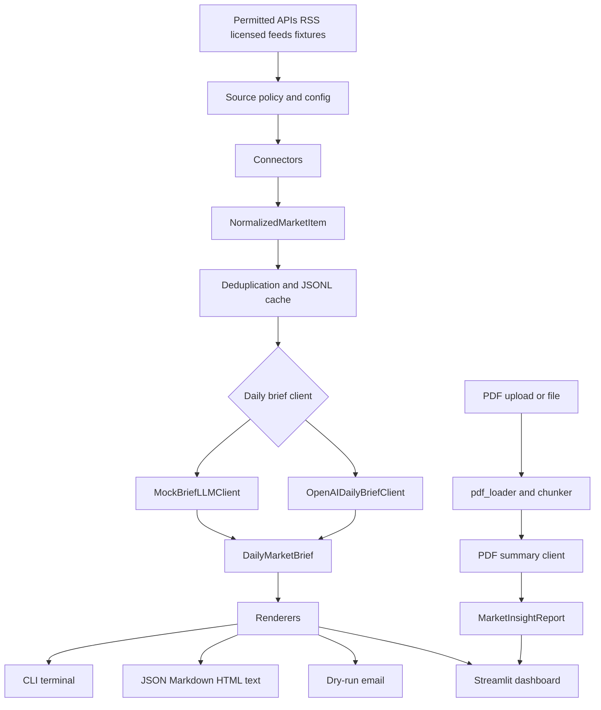

# Market PDF Insights

`market-pdf-insights` is a public market-intelligence briefing app plus a PDF research
summarizer. The Pivot 2 MVP builds a daily market brief from permitted inputs, preserves
source citations, flags claims for verification, renders JSON/Markdown/HTML/text outputs, and
can write dry-run email files without sending real email.

The daily brief is scoped to factual information and general market commentary. It does not
personalize output to a user's objectives, financial situation, or needs, and it must not
provide buy/sell/hold recommendations.

Pivot 3 starts a separate private, single-user research companion for subscribed material. It is
for user-provided documents and permitted exports first; logged-in automation remains disabled
unless subscription terms explicitly permit the exact access pattern.

## Documentation

- [Market intelligence architecture](docs/market-intelligence-architecture.md)
- [Source policy](docs/source-policy.md)
- [Source registry](docs/source-registry.md)
- [Ingestion framework](docs/ingestion-framework.md)
- [Australian connectors](docs/australian-connectors.md)
- [Global connectors](docs/global-connectors.md)
- [Daily brief schema](docs/daily-brief-schema.md)
- [Daily brief synthesis](docs/daily-brief-synthesis.md)
- [Daily brief rendering](docs/daily-brief-rendering.md)
- [Daily brief operations](docs/daily-brief-operations.md)
- [Deployment guide](docs/deployment.md)
- [Private research architecture](docs/private-research-architecture.md)
- [Private research policy](docs/private-research-policy.md)

## Product Overview

The daily market-intelligence workflow:

1. Loads source items from legal APIs, RSS feeds, licensed feeds, user-provided files, or local
   fixtures.
2. Normalizes each item with attribution, terms metadata, timestamps, URLs, and tickers.
3. Deduplicates items and optionally stores them in a JSONL cache.
4. Synthesizes a validated `DailyMarketBrief` with a placeholder/mock client or OpenAI.
5. Renders dashboard, terminal, JSON, Markdown, HTML, plain text, and dry-run email output.

The original PDF workflow remains available for summarizing individual research PDFs into
structured `MarketInsightReport` output.

## Source Policy

Allowed input patterns:

- official APIs;
- RSS feeds where automated access is permitted;
- paid or licensed feeds where the licence permits this use;
- user-provided files, exports, forwarded emails, or manual notes.

Do not scrape Bloomberg, Reuters, TradingView, Market Index, ASX pages, or similar sites unless
the specific access pattern is permitted by licence, API terms, written permission, or a
documented user export. Do not bypass logins, paywalls, bot controls, rate limits, or technical
access restrictions. Do not store or redistribute full copyrighted articles or paid reports.

## Supported Sources

The registry is conservative. Many sources are disabled until credentials, endpoint scope,
licence terms, and rate limits are configured.

| Source | Status | Access path |
| --- | --- | --- |
| Local fixtures/user files | Enabled for mock mode | `LocalFixtureConnector`, `MockConnector` |
| RBA RSS | Connector available | Official RSS feed |
| ABS | Connector available | Official ABS API or user export |
| ASIC media | Gated | Permitted API/feed/export only |
| FRED | Connector available | Official API with `FRED_API_KEY` |
| World Bank | Connector available | Official API |
| GDELT | Connector available | Public API metadata/links |
| NewsAPI | Connector available | API with `NEWSAPI_KEY` |
| ASX, Market Index | Disabled by default | Licensed API/feed or user export only |
| Bloomberg, Reuters | Disabled by default | Licensed feed/export only |
| TradingView | Disabled by default | Alerts, exports, embeds, or permitted API only |

## Install

```bash
python -m venv .venv
source .venv/bin/activate
pip install -e ".[dev]"
```

Copy the environment example if you plan to use hosted LLMs or credentialed connectors:

```bash
cp .env.example .env
```

The app does not auto-load `.env`; export variables in your shell or load them with your own
environment tooling.

## Environment Variables

| Variable | Required for | Notes |
| --- | --- | --- |
| `OPENAI_API_KEY` | `--llm openai` | Billed to the OpenAI account/project that owns the key. |
| `MARKET_PDF_INSIGHTS_MODEL` | Optional | Overrides the default OpenAI model. |
| `FRED_API_KEY` | FRED connector | Keep in the environment or scheduler secret store. |
| `NEWSAPI_KEY` | NewsAPI connector | Keep in the environment or scheduler secret store. |

No API key is hardcoded. Tests clear these environment variables and use fake clients,
fixtures, and mocks.

## CLI Examples

Run the fixture-backed public daily brief with no live APIs:

```bash
market-pdf-insights brief validate-config --config examples/daily_brief_config.toml
market-pdf-insights brief sources --config examples/daily_brief_config.toml
market-pdf-insights brief run \
  --config examples/daily_brief_config.toml \
  --date 2026-05-12 \
  --output outputs/daily-brief.json \
  --markdown outputs/daily-brief.md \
  --html outputs/daily-brief.html
```

Write a dry-run email file without sending:

```bash
market-pdf-insights brief send \
  --dry-run \
  --config examples/daily_brief_config.toml \
  --email-dry-run outputs/daily-brief.eml
```

Use OpenAI for daily brief synthesis:

```bash
export OPENAI_API_KEY="..."
market-pdf-insights brief run \
  --config examples/daily_brief_config.toml \
  --llm openai \
  --model gpt-4.1-mini
```

Summarize a PDF report:

```bash
market-pdf-insights summarize reports/small-caps-report-issue-700.pdf \
  --output report.json \
  --markdown report.md
```

## Streamlit Dashboard

Run the web app locally:

```bash
streamlit run src/market_pdf_insights/streamlit_app.py
```

The dashboard opens with the daily brief workflow backed by
`examples/daily_brief_config.toml` and `examples/daily_market_brief.json`, so it can render a
fixture brief without live APIs. It shows source status, disabled-source compliance notes,
executive summary, recap/day-ahead, themes, risks, watchlist impacts, citations, verification
flags, and JSON/Markdown/HTML downloads. A second tab keeps the PDF upload workflow.

## Email

Current email support is intentionally dry-run only. `DailyBriefEmailSettings` stores sender,
recipient, subject prefix, and reply-to envelope settings. `DryRunDailyBriefEmailWriter` writes
`.eml` or text/HTML files locally. A future sender can implement `DailyBriefEmailSender` for
SMTP or a provider API, with credentials supplied by environment variables or a secret store.

## Scheduling

Use an external scheduler; the app does not run a background daemon.

Cron example:

```cron
15 7 * * 1-5 cd /path/to/flying-the-radar && \
  MARKET_PDF_INSIGHTS_MODEL=gpt-4.1-mini \
  market-pdf-insights brief run --config daily-brief.toml
```

GitHub Actions example:

```yaml
name: Daily market brief
on:
  schedule:
    - cron: "15 21 * * 0-4"
  workflow_dispatch:
jobs:
  brief:
    runs-on: ubuntu-latest
    steps:
      - uses: actions/checkout@v4
      - uses: actions/setup-python@v5
        with:
          python-version: "3.12"
      - run: pip install -e ".[dev]"
      - run: market-pdf-insights brief run --config examples/daily_brief_config.toml
        env:
          OPENAI_API_KEY: ${{ secrets.OPENAI_API_KEY }}
          FRED_API_KEY: ${{ secrets.FRED_API_KEY }}
          NEWSAPI_KEY: ${{ secrets.NEWSAPI_KEY }}
```

Store credentials in the scheduler's secret manager, not in TOML, fixtures, docs, or source
control.

## Citations And Verification

Daily brief citations live in `DailyMarketBrief.sources`. Nested sections reference those
records by `citation_id`, and each citation preserves source name, title, URL, publication time,
retrieval time, terms URL, licence notes, and a short snippet. The schema rejects nested
citations that are missing from the top-level catalogue.

Claims that need human review are stored in `DailyMarketBrief.verification_flags`. Numbers,
dates, prices, forecasts, yields, legal/regulatory claims, and stale source items should be
checked against primary sources before use.

## Architecture



Core modules:

- `source_policy.py`: source-use and advice-boundary guardrails.
- `source_registry.py`: source metadata, credentials, capabilities, and compliance checks.
- `ingestion.py`: connectors, normalization, deduplication, JSONL cache, and test mocks.
- `australian_connectors.py`: RBA, ABS, ASIC scaffolding and disabled ASX/Market Index guards.
- `global_connectors.py`: FRED, World Bank, GDELT, NewsAPI, and licensed-source placeholders.
- `daily_brief_schema.py`: validated daily brief output contract.
- `daily_brief_synthesis.py`: mock/OpenAI daily brief synthesis.
- `daily_brief_rendering.py`: JSON, Markdown, HTML, text, terminal, and dry-run email rendering.
- `daily_brief_config.py`: TOML configuration and validation.
- `daily_brief_runner.py`: configured ingestion, synthesis, output writing, and dry-run email.
- `cli.py`: `market-pdf-insights summarize` and `market-pdf-insights brief ...`.
- `streamlit_app.py`: daily brief dashboard and PDF report tab.

## Development

Run tests and lint:

```bash
PYTHONPATH=src python3 -m pytest
PYTHONPATH=src python3 -m unittest discover -s tests
ruff check .
```

The test suite is offline. It blocks live network calls, clears real API key environment
variables, and uses fixture payloads plus mock clients.

## Limitations

- Placeholder and mock clients are deterministic and useful for tests/local plumbing, not
  high-quality market analysis.
- OpenAI output is schema-validated, but factual correctness still depends on source quality and
  human verification.
- Live source connectors require source-specific endpoint scope, credentials, rate limits, and
  terms review before being enabled.
- The app does not send email yet; only dry-run email files are written.
- The app does not include a background scheduler.
- Extracted PDF text quality depends on the source document; scanned PDFs without OCR may
  produce little useful text.
- Generated outputs can be incomplete, stale, or misleading.

## Financial Disclaimer

This project summarizes source documents and public market information. It is not financial,
investment, tax, legal, or accounting advice. Outputs may be incomplete, inaccurate, stale, or
misleading. Do not make investment decisions based only on this tool. Always verify claims
against primary sources and consult qualified professionals where appropriate.

## Contributing

Keep changes small, tested, and consistent with the current module boundaries.

Before opening a pull request:

- Run `python3 -m pytest`.
- Run `ruff check .`.
- Avoid committing generated outputs, cache directories, local PDFs, or secrets.
- Do not include real API keys in tests, fixtures, examples, docs, or screenshots.
- Prefer mock clients and fixture payloads so CI does not make live API calls.
