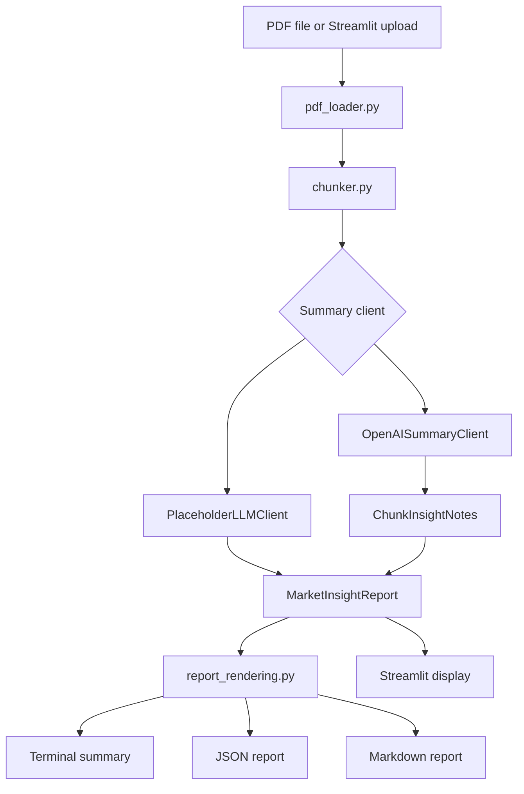

# Market PDF Insights

`market-pdf-insights` turns stock market commentary and financial research PDFs into
structured summaries. It extracts PDF text with PyMuPDF, chunks long documents, validates
outputs with Pydantic, and can summarize through either a deterministic local placeholder
or the OpenAI API.

The project is intended for document review and research workflow automation. It does not
provide investment recommendations.

## Features

- PDF text extraction with page markers and clear PDF loading errors.
- Overlapping text chunking for long reports.
- Pydantic `MarketInsightReport` output with claims, risks, assets, macro assumptions,
  numbers to verify, stance, confidence, and finance-specific fields.
- CLI output with a clean terminal summary, optional JSON file, and optional Markdown file.
- Streamlit app for upload, summary review, and report downloads.
- OpenAI-backed summarization with JSON validation and retry handling.
- Placeholder and mock clients for local development and tests.

## Install

```bash
python -m venv .venv
source .venv/bin/activate
pip install -e ".[dev]"
```

Copy the environment example if you plan to use the OpenAI backend:

```bash
cp .env.example .env
```

The app does not auto-load `.env`; export variables in your shell or load them with your
own environment tooling.

## CLI Usage

Print a concise terminal summary:

```bash
market-pdf-insights summarize reports/small-caps-report-issue-700.pdf
```

Save the full structured JSON:

```bash
market-pdf-insights summarize reports/small-caps-report-issue-700.pdf \
  --output report.json
```

Save JSON and Markdown:

```bash
market-pdf-insights summarize reports/small-caps-report-issue-700.pdf \
  --output report.json \
  --markdown report.md
```

Control chunk size:

```bash
market-pdf-insights summarize reports/small-caps-report-issue-700.pdf \
  --max-chars 6000
```

Use OpenAI instead of the default placeholder backend:

```bash
export OPENAI_API_KEY="..."
market-pdf-insights summarize reports/small-caps-report-issue-700.pdf \
  --llm openai \
  --model gpt-4.1-mini \
  --output report.json
```

The account billed is the OpenAI account or project associated with the `OPENAI_API_KEY`
in your environment. No API key is hardcoded, and tests use fake or mock clients.

## Streamlit App

Run the web app locally:

```bash
streamlit run src/market_pdf_insights/streamlit_app.py
```

The app lets you upload a PDF, choose the placeholder or OpenAI backend, summarize the
report, review the main fields, and download JSON or Markdown output.

## Output Shape

The report is validated as a `MarketInsightReport`. A compact example:

```json
{
  "document_title": "Research Note",
  "executive_summary": "...",
  "market_stance": "mixed",
  "investment_thesis": "...",
  "bullish_arguments": [],
  "bearish_arguments": [],
  "valuation_assumptions": [],
  "time_horizon": "medium term",
  "catalysts": [],
  "key_claims": [],
  "supporting_evidence": [],
  "risks": [],
  "sectors_mentioned": [],
  "companies_or_tickers_mentioned": [],
  "macro_assumptions": [],
  "numbers_to_verify": [],
  "unanswered_questions": [],
  "confidence_score": 0.35,
  "source_file": "path/to/file.pdf",
  "metadata": {}
}
```

See [examples/market_insight_report.json](examples/market_insight_report.json) for a
fuller validated example.

## Architecture



Core modules:

- `pdf_loader.py`: validates PDF paths and extracts ordered page text.
- `chunker.py`: splits long text into overlapping chunks.
- `insight_schema.py`: defines Pydantic report models.
- `llm_client.py`: provides placeholder, mock, and OpenAI summarization clients.
- `summarizer.py`: orchestrates PDF loading, chunking, and summarization.
- `report_rendering.py`: renders terminal and Markdown summaries.
- `cli.py`: exposes the `market-pdf-insights` command.
- `streamlit_app.py`: exposes the upload-and-summarize web app.

## Development

Run the test suite:

```bash
PYTHONPATH=src python3 -m unittest discover -s tests
python3 -m pytest
```

Run linting:

```bash
ruff check .
```

Run the example API script:

```bash
python examples/summarize_pdf.py reports/small-caps-report-issue-700.pdf
```

## Limitations

- The placeholder client is deterministic and heuristic-based; it is useful for tests and
  local plumbing, not high-quality market analysis.
- The OpenAI client depends on model output quality and validates structure, not factual
  correctness.
- Extracted PDF text quality depends on the source document. Scanned PDFs without OCR may
  produce little or no useful text.
- Numbers, dates, forecasts, prices, valuation claims, and market data should be verified
  against primary sources.
- This tool does not fetch live market data, filings, or news.
- The Streamlit app stores uploaded PDFs only in temporary files during processing.

## Financial Disclaimer

This project summarizes and analyzes source documents. It is not financial, investment,
tax, legal, or accounting advice. Outputs may be incomplete, inaccurate, stale, or
misleading. Do not make investment decisions based only on this tool. Always verify claims
against primary sources and consult qualified professionals where appropriate.

## Contributing

Contributions are welcome. Keep changes small, tested, and consistent with the current
module boundaries.

Before opening a pull request:

- Run `python3 -m pytest`.
- Run `ruff check .`.
- Avoid committing PDFs, generated reports, cache directories, or secrets.
- Do not include real API keys in tests, fixtures, examples, or docs.
- Prefer mock clients in tests so CI does not make live API calls.

