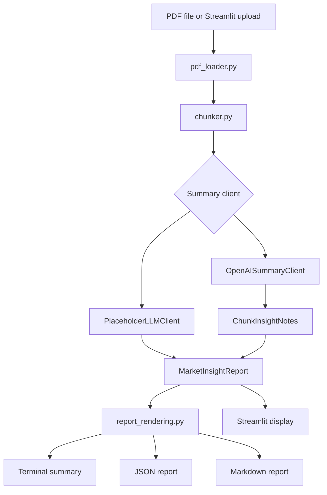

# Market PDF Insights

`market-pdf-insights` turns stock market commentary and financial research PDFs into
structured summaries. It extracts PDF text with PyMuPDF, chunks long documents, validates
outputs with Pydantic, and can summarize through either a deterministic local placeholder
or the OpenAI API.

The project is intended for document review and research workflow automation. It does not
provide investment recommendations.

## Pivot 2: Daily Market Intelligence

The next product direction is a public daily market-intelligence brief built from permitted
sources only: official APIs, RSS feeds, licensed data providers, user-provided files, or
email/manual ingestion. The app must not scrape sites that prohibit automated access, bypass
paywalls, or redistribute copyrighted source material.

This branch is scoped to factual information and general market commentary. It should not
personalize output to a user's objectives, financial situation, or needs, and it should not
provide buy/sell/hold recommendations.

See:

- [Market intelligence architecture](docs/market-intelligence-architecture.md)
- [Source policy](docs/source-policy.md)
- [Source registry](docs/source-registry.md)
- [Ingestion framework](docs/ingestion-framework.md)
- [Australian connectors](docs/australian-connectors.md)
- [Global connectors](docs/global-connectors.md)
- [Daily brief schema](docs/daily-brief-schema.md)
- [Daily brief synthesis](docs/daily-brief-synthesis.md)
- [Daily brief rendering](docs/daily-brief-rendering.md)
- [Daily brief operations](docs/daily-brief-operations.md)

## Features

- PDF text extraction with page markers and clear PDF loading errors.
- Overlapping text chunking for long reports.
- Pydantic `MarketInsightReport` output with claims, risks, assets, macro assumptions,
  numbers to verify, stance, confidence, and finance-specific fields.
- CLI output with a clean terminal summary, optional JSON file, and optional Markdown file.
- Streamlit app for upload, summary review, and report downloads.
- OpenAI-backed summarization with JSON validation and retry handling.
- Placeholder and mock clients for local development and tests.
- Public-source ingestion framework with RSS, JSON API, local fixture, deduplication, and
  JSONL cache support.
- Australia-specific connector scaffolding for RBA RSS, ABS Data API/exports, permitted ASIC
  exports, and disabled ASX/Market Index placeholders.
- Global macro/news connector scaffolding for FRED, World Bank, GDELT, NewsAPI, and disabled
  IMF/OECD/Bloomberg/Reuters placeholders.
- Daily public market-intelligence brief schema with first-class source citations and
  short-snippet validation.
- LLM synthesis layer for grouped source notes and final validated daily briefs.
- Daily brief rendering to JSON, Markdown, HTML, plain text, terminal summary, and dry-run
  email output.
- Daily brief CLI operations for TOML config validation, source status, fixture-backed runs,
  rendered outputs, and dry-run email files.

## Install

```bash
python -m venv .venv
source .venv/bin/activate
pip install -e ".[dev]"
```

Copy the environment example if you plan to use the OpenAI backend:

```bash
cp .env.example .env
```

The app does not auto-load `.env`; export variables in your shell or load them with your
own environment tooling.

## CLI Usage

Print a concise terminal summary:

```bash
market-pdf-insights summarize reports/small-caps-report-issue-700.pdf
```

Save the full structured JSON:

```bash
market-pdf-insights summarize reports/small-caps-report-issue-700.pdf \
  --output report.json
```

Save JSON and Markdown:

```bash
market-pdf-insights summarize reports/small-caps-report-issue-700.pdf \
  --output report.json \
  --markdown report.md
```

Run a fixture-backed daily market brief:

```bash
market-pdf-insights brief validate-config --config examples/daily_brief_config.toml
market-pdf-insights brief run \
  --config examples/daily_brief_config.toml \
  --date 2026-05-12 \
  --output outputs/daily-brief.json \
  --markdown outputs/daily-brief.md \
  --html outputs/daily-brief.html
```

Write a dry-run email file:

```bash
market-pdf-insights brief send \
  --dry-run \
  --config examples/daily_brief_config.toml \
  --email-dry-run outputs/daily-brief.eml
```

Control chunk size:

```bash
market-pdf-insights summarize reports/small-caps-report-issue-700.pdf \
  --max-chars 6000
```

Use OpenAI instead of the default placeholder backend:

```bash
export OPENAI_API_KEY="..."
market-pdf-insights summarize reports/small-caps-report-issue-700.pdf \
  --llm openai \
  --model gpt-4.1-mini \
  --output report.json
```

The account billed is the OpenAI account or project associated with the `OPENAI_API_KEY`
in your environment. No API key is hardcoded, and tests use fake or mock clients.

## Streamlit App

Run the web app locally:

```bash
streamlit run src/market_pdf_insights/streamlit_app.py
```

The app lets you upload a PDF, choose the placeholder or OpenAI backend, summarize the
report, review the main fields, and download JSON or Markdown output.

## Output Shape

The report is validated as a `MarketInsightReport`. A compact example:

```json
{
  "document_title": "Research Note",
  "executive_summary": "...",
  "market_stance": "mixed",
  "investment_thesis": "...",
  "bullish_arguments": [],
  "bearish_arguments": [],
  "valuation_assumptions": [],
  "time_horizon": "medium term",
  "catalysts": [],
  "key_claims": [],
  "supporting_evidence": [],
  "risks": [],
  "sectors_mentioned": [],
  "companies_or_tickers_mentioned": [],
  "macro_assumptions": [],
  "numbers_to_verify": [],
  "unanswered_questions": [],
  "confidence_score": 0.35,
  "source_file": "path/to/file.pdf",
  "metadata": {}
}
```

See [examples/market_insight_report.json](examples/market_insight_report.json) for a
fuller validated example.

See [examples/daily_market_brief.json](examples/daily_market_brief.json) for the Pivot 2
daily market-intelligence brief shape.

## Architecture



Core modules:

- `pdf_loader.py`: validates PDF paths and extracts ordered page text.
- `chunker.py`: splits long text into overlapping chunks.
- `insight_schema.py`: defines Pydantic report models.
- `ingestion.py`: fetches, normalizes, deduplicates, and caches public source items.
- `australian_connectors.py`: defines legal Australian market-intelligence connectors and
  disabled placeholders.
- `global_connectors.py`: defines global macro/news connectors, credential config, and
  licensed-source placeholders.
- `daily_brief_schema.py`: defines the structured daily public market-intelligence brief.
- `daily_brief_synthesis.py`: synthesizes normalized source items into daily briefs.
- `daily_brief_rendering.py`: renders daily briefs and writes dry-run email output.
- `daily_brief_config.py`: loads and validates daily brief TOML configuration.
- `daily_brief_runner.py`: runs configured ingestion, synthesis, rendering, and dry-run email.
- `llm_client.py`: provides placeholder, mock, and OpenAI summarization clients.
- `summarizer.py`: orchestrates PDF loading, chunking, and summarization.
- `report_rendering.py`: renders terminal and Markdown summaries.
- `source_policy.py`: defines Pivot 2 source-use and advice-boundary guardrails.
- `source_registry.py`: centralizes public source metadata, credentials, and compliance checks.
- `cli.py`: exposes the `market-pdf-insights` command.
- `streamlit_app.py`: exposes the upload-and-summarize web app.

## Development

Run the test suite:

```bash
PYTHONPATH=src python3 -m unittest discover -s tests
python3 -m pytest
```

Run linting:

```bash
ruff check .
```

Run the example API script:

```bash
python examples/summarize_pdf.py reports/small-caps-report-issue-700.pdf
```

## Limitations

- The placeholder client is deterministic and heuristic-based; it is useful for tests and
  local plumbing, not high-quality market analysis.
- The OpenAI client depends on model output quality and validates structure, not factual
  correctness.
- Extracted PDF text quality depends on the source document. Scanned PDFs without OCR may
  produce little or no useful text.
- Numbers, dates, forecasts, prices, valuation claims, and market data should be verified
  against primary sources.
- Live market-data, filing, and news connectors are disabled until source-specific access
  settings and terms are configured.
- Daily brief email support currently renders and writes dry-run output only; SMTP or provider
  credentials must be configured in a separate sender implementation later.
- The Streamlit app stores uploaded PDFs only in temporary files during processing.
- Pivot 2 connectors must use permitted APIs, RSS feeds, licensed sources, user-provided
  content, or email/manual ingestion; prohibited scraping remains out of scope.

## Financial Disclaimer

This project summarizes and analyzes source documents. It is not financial, investment,
tax, legal, or accounting advice. Outputs may be incomplete, inaccurate, stale, or
misleading. Do not make investment decisions based only on this tool. Always verify claims
against primary sources and consult qualified professionals where appropriate.

## Contributing

Contributions are welcome. Keep changes small, tested, and consistent with the current
module boundaries.

Before opening a pull request:

- Run `python3 -m pytest`.
- Run `ruff check .`.
- Avoid committing PDFs, generated reports, cache directories, or secrets.
- Do not include real API keys in tests, fixtures, examples, or docs.
- Prefer mock clients in tests so CI does not make live API calls.
