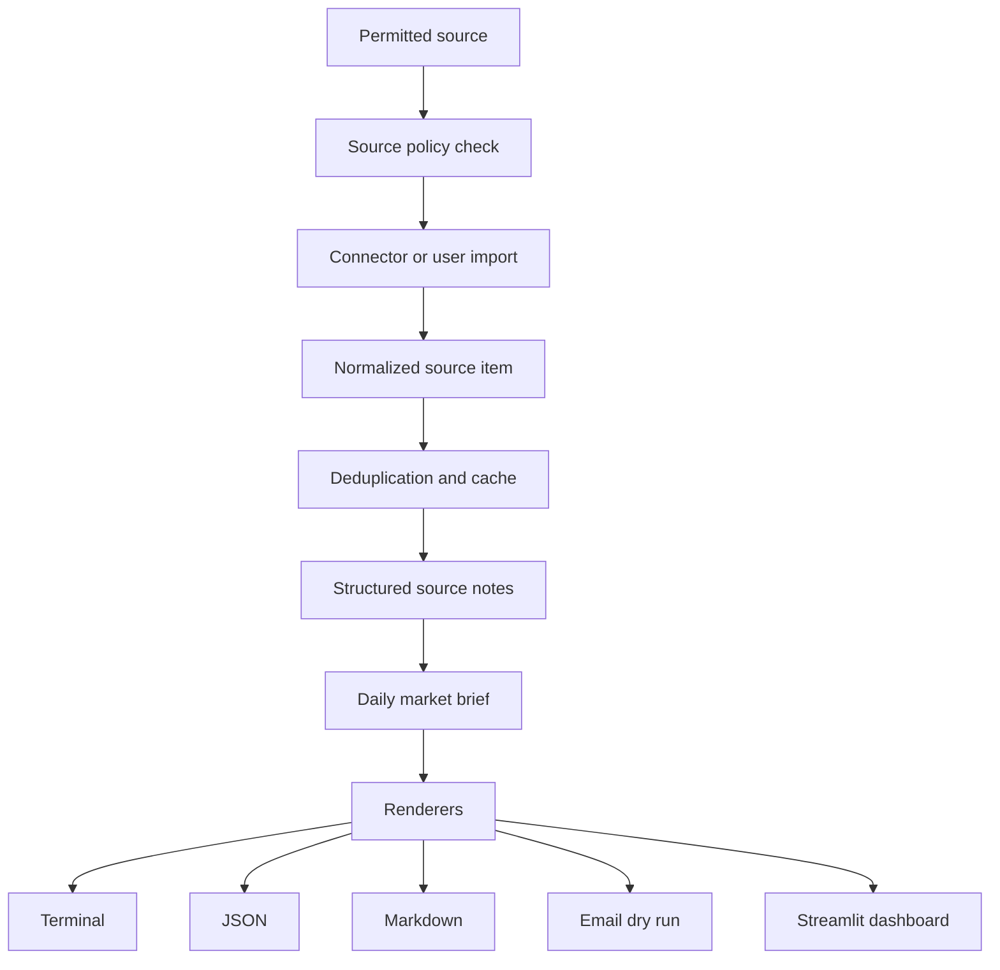

# Market Intelligence Architecture

Pivot 2 extends the existing PDF summarizer into a daily market-intelligence briefing
system. The current PDF workflow remains useful as one ingestion path, but the broader
product should treat every input as a source item with attribution, retrieval metadata, and
source-use policy.

## Product Boundary

The public daily brief is for factual information and general market commentary only. It
must not generate personal financial advice, portfolio instructions, or buy/sell/hold
recommendations. ASIC distinguishes factual information, general advice, and personal
advice, and notes that personal advice considers, or could reasonably be expected to
consider, a person's objectives, financial situation, or needs.

The app should therefore:

- summarize what sources say;
- cite source URLs and retrieval times;
- flag claims that need external verification;
- avoid tailoring output to a person's circumstances;
- avoid recommending transactions or portfolio actions.

## Source-First Flow

## Planned Extension Points

- Source connectors: RSS, public API, licensed feed, email forward, user upload, manual entry.
- Source policy: enabled flag, access method, terms notes, rate-limit notes, attribution rules,
  and redistribution policy.
- Storage: local cache of normalized items and generated brief metadata.
- Summarizers: placeholder, mock, OpenAI, and future providers.
- Renderers: terminal, Markdown, JSON, HTML email, plain-text email.
- Schedule: external cron/GitHub Actions/local task runner invoking CLI commands.

## Current Step

This step adds the guardrail and source policy foundation only. It intentionally does not
fetch live market data, scrape websites, send email, or implement a scheduler.

