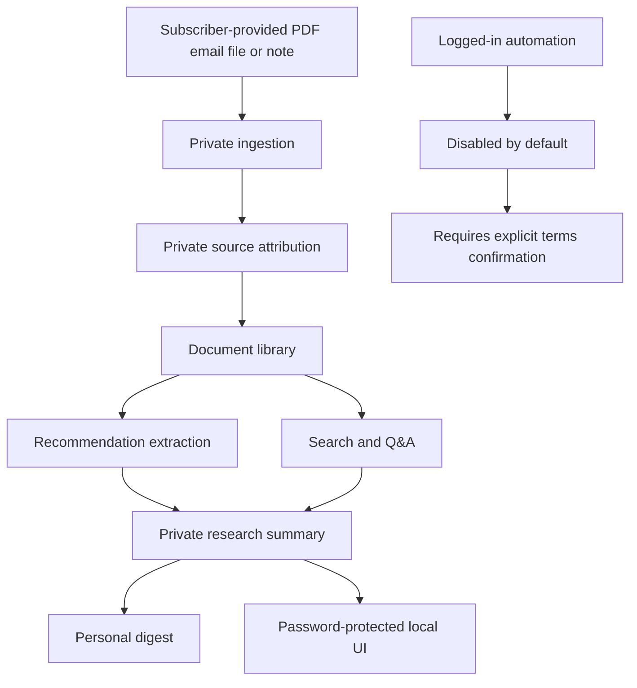

# Private Research Architecture

Pivot 3 adds a private, single-user research companion for subscribed material such as Under
the Radar reports. It is separate from the public daily market brief.

## Scope

The private workflow helps a subscriber ingest, organize, summarize, search, and review
research they are already entitled to access. It is designed for personal use first.

The private workflow must not:

- redistribute paid or subscription-only content;
- bypass logins, paywalls, bot controls, or technical access restrictions;
- assume that a login grants scraping, copying, storage, or redistribution rights;
- provide personalized financial advice or buy/sell/hold instructions;
- mix paid private source text into public daily brief outputs.

Preferred input paths:

- PDF upload;
- local files the user has downloaded;
- forwarded emails or saved email files;
- manual entry;
- exports explicitly permitted by subscription terms.

Logged-in automation is not implemented. An optional Under the Radar connector stub exists only
to model future safety gates. It stays disabled by default and requires explicit user
confirmation that subscription terms permit the exact access pattern.

## Architecture

## Planned Module Boundaries

- `private_research_policy.py`: private-use guardrails and source attribution models.
  Implemented now.
- `private_settings.py`: local-only settings, retention policy, and password hash references.
  Implemented now.
- `private_research_storage.py`: SQLite document, summary, and citation metadata store.
  Implemented now.
- `private_ingestion.py`: upload, local-file, email, manual, and permitted export importers.
  No logged-in scraping.
- `private_research_schema.py`: structured private recommendation models for company ratings,
  thesis points, risks, catalysts, valuation notes, watch items, source excerpts, and personal
  research questions.
- `private_research_synthesis.py`: two-stage private summarizer that extracts chunk notes and
  synthesizes validated `PrivateResearchDocument` output with safety prompts and JSON retries.
- `private_undertheradar_connector.py`: disabled Under the Radar connector stub. It validates
  environment, terms, settings, and credential gates, then refuses live automation.
- `private_research_library.py`: local private recommendation search, history, latest ticker
  lookup, document comparison, and unresolved verification questions.
- `private_recommendations.py`: extract recommendations, risks, catalysts, and valuation notes.
  No personal advice.
- `private_digest.py`: render private single-user digests. No redistribution workflow.
- `private_search.py`: search/Q&A over local private records. Cite local source records.
- `private_ui.py`: password-protected local UI screens. No unauthenticated private content.

## Separation From Pivot 2

Pivot 2 public daily briefs use `NormalizedMarketItem` records from permitted public/legal
sources. Pivot 3 private research will use separate private records and attribution metadata so
subscription material is not accidentally republished through the public brief pipeline.

Shared code is allowed only where boundaries are clear:

- PDF extraction and chunking;
- generic LLM client plumbing;
- rendering helpers where output remains private;
- guardrail/testing patterns.

## Current Step

The current implementation has private-use boundary models, secure local settings, password hash
helpers, local SQLite storage for metadata, summaries, and citations, and user-driven private
ingestion for PDFs, local directories, saved HTML/text/email files, and manual pasted text.

The private CLI supports:

- `market-pdf-insights private import path/to/file_or_dir`;
- `market-pdf-insights private list`;
- `market-pdf-insights private summarize DOCUMENT_ID`.

The current implementation also has a private recommendation schema with short excerpt limits,
rating normalization, source document references, and confidence validation. It now includes a
private summarizer that chunks imported extracted text, creates source-grounded chunk notes, and
synthesizes validated private recommendation output. The default client is deterministic and
offline; the OpenAI client is injectable and retries malformed JSON.

The current private library indexes structured summaries into local recommendation rows and
supports ticker/company/date/rating/sector/keyword search, recommendation history, document
comparison, and unresolved verification questions. The Under the Radar connector is only a
disabled safety stub; it does not implement live login, scraping, browser automation, or PDF
download. The app also does not yet implement a password-protected UI, natural-language
search/Q&A, or a private digest.
