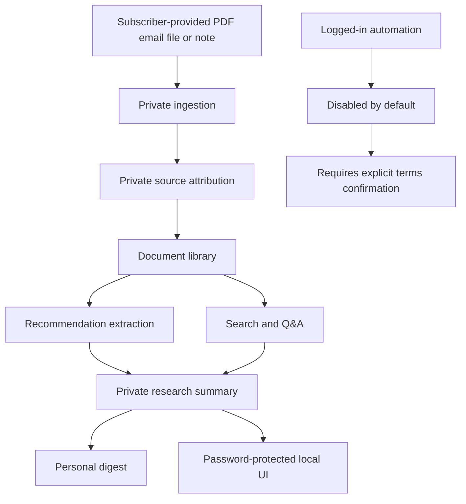

# Private Research Architecture

Pivot 3 adds a private, single-user research companion for subscribed material such as Under
the Radar reports. It is separate from the public daily market brief.

## Scope

The private workflow helps a subscriber ingest, organize, summarize, search, and review
research they are already entitled to access. It is designed for personal use first.

The private workflow must not:

- redistribute paid or subscription-only content;
- bypass logins, paywalls, bot controls, or technical access restrictions;
- assume that a login grants scraping, copying, storage, or redistribution rights;
- provide personalized financial advice or buy/sell/hold instructions;
- mix paid private source text into public daily brief outputs.

Preferred input paths:

- PDF upload;
- local files the user has downloaded;
- forwarded emails or saved email files;
- manual entry;
- exports explicitly permitted by subscription terms.

Logged-in automation is not implemented in this step. Any future logged-in connector must stay
disabled by default and require explicit user confirmation that subscription terms permit the
exact access pattern.

## Architecture

## Planned Module Boundaries

- `private_research_policy.py`: private-use guardrails and source attribution models.
  Implemented now.
- `private_settings.py`: local-only settings, retention policy, and password hash references.
  Implemented now.
- `private_research_storage.py`: SQLite document, summary, and citation metadata store.
  Implemented now.
- `private_ingestion.py`: upload, local-file, email, manual, and permitted export importers.
  No logged-in scraping.
- `private_library.py`: private document metadata, storage, and history. Separate from the
  public brief cache.
- `private_recommendations.py`: extract recommendations, risks, catalysts, and valuation notes.
  No personal advice.
- `private_digest.py`: render private single-user digests. No redistribution workflow.
- `private_search.py`: search/Q&A over local private records. Cite local source records.
- `private_ui.py`: password-protected local UI screens. No unauthenticated private content.

## Separation From Pivot 2

Pivot 2 public daily briefs use `NormalizedMarketItem` records from permitted public/legal
sources. Pivot 3 private research will use separate private records and attribution metadata so
subscription material is not accidentally republished through the public brief pipeline.

Shared code is allowed only where boundaries are clear:

- PDF extraction and chunking;
- generic LLM client plumbing;
- rendering helpers where output remains private;
- guardrail/testing patterns.

## Current Step

The current implementation has private-use boundary models, secure local settings, password hash
helpers, and local SQLite storage for metadata, summaries, and citations. It does not implement
email import, Under the Radar login automation, scraping, password UI, recommendation extraction,
or private digest output.
